# Microservice architecture

Github: [Microservice architecture](https://github.com/kretsulaksusha/microservice_architecture.git)

## Task 5. Microservices using Service Discovery and Config Server based on Consul

Github: [Microservice architecture. Task 5](https://github.com/kretsulaksusha/microservice_architecture/tree/micro_consul)

The task is based on the functionality developed in the previous task and is its further development.

Consul should be added to the system to act as a Service Register, Service Discovery and Config Server.

This will allow you to not explicitly specify microservice addresses and configurations for Hazelcast and Message Queue.

### Task

Requirements:

1. All microservices must dynamically register themselves at startup in Consul, and there may be multiple instances of each service running (this will be displayed as the number of instances on the UI):

    - `facade-service`
    - `logging-service`
    - `messages-service`

    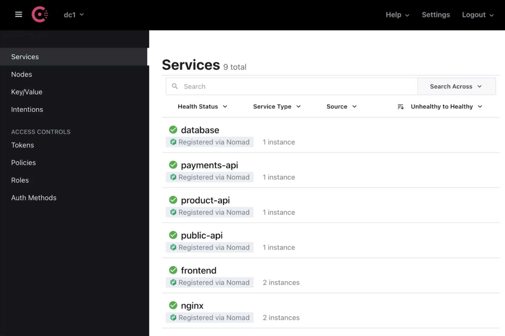

2. When `facade-service` calls `logging-service` and `messages-service`, the IP addresses (and ports) must be read by `facade-service` from Consul. No static address values should be set in the code or configurations.

3. Settings for Hazelcast clients must be stored as key/value in Consul and read by the `logging-service`.

4. Message Queue settings (address, queue name, ...) should be stored as key/value in Consul and read by `facade-service` and `messages-service`.

5. Demonstrate that if an instance of a particular microservice is disabled, it will be displayed in Consul (the disabled service instance will change its status) and calls will be redirected to other working instances.

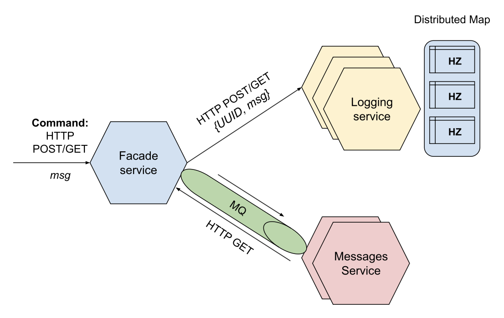

## Prerequisites

- Python (Hazelcast)
- Consul

### Installation

```text
git clone https://github.com/kretsulaksusha/microservice_architecture.git
cd microservice_architecture
git checkout micro_consul
```

### Project structure

```text
.
├── consul_service
│   └── consul_service.py
├── docker-compose.yml
├── facade-service
│   └── facade-service.py
├── hazelcast-client.xml
├── logging-service
│   └── logging-service.py
├── media
│   └── ...
├── messages-service
│   └── messages-service.py
├── README.md
└── scripts
    ├── kill.sh
    ├── launch.sh
    ├── logs
    │   ├── send_get_req_log.txt
    │   └── send_post_req_log.txt
    ├── send_get_req.sh
    ├── send_post_req.sh
    └── test_shut_down.sh

9 directories, 32 files
```

### Usage

1. Docker:

    ```shell
    docker-compose up --build
    ```

2. Launching the system (Docker, Hazelcast nodes, services):

    ```shell
    ./scripts/launch.sh
    ```

3. POST request

    ```shell
    ./scripts/send_post_req.sh
    ```

4. GET request

    ```shell
    ./scripts/send_get_req.sh
    ```

5. Disabling an instance of a microservice

    Disable an instance of logging service with the Hazelcast instance:

    ```shell
    ./scripts/test_shut_down.sh 1
    ```

    Now test GET request:

    ```shell
    ./scripts/send_get_req.sh
    ```

    Test POST request:

    ```shell
    ./scripts/send_post_req.sh
    ```

6. Stop the system

    ```shell
    ./scripts/kill.sh
    ```

### Results

1. Docker:

    ```shell
    docker-compose up --build
    ```

    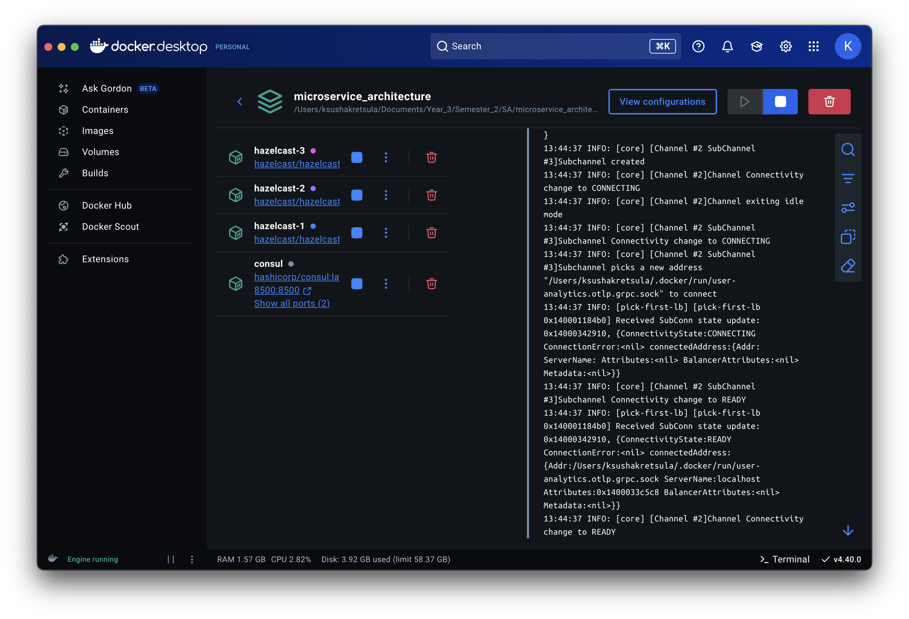

2. Launching the system:

    ```shell
    ./scripts/launch.sh
    ```

    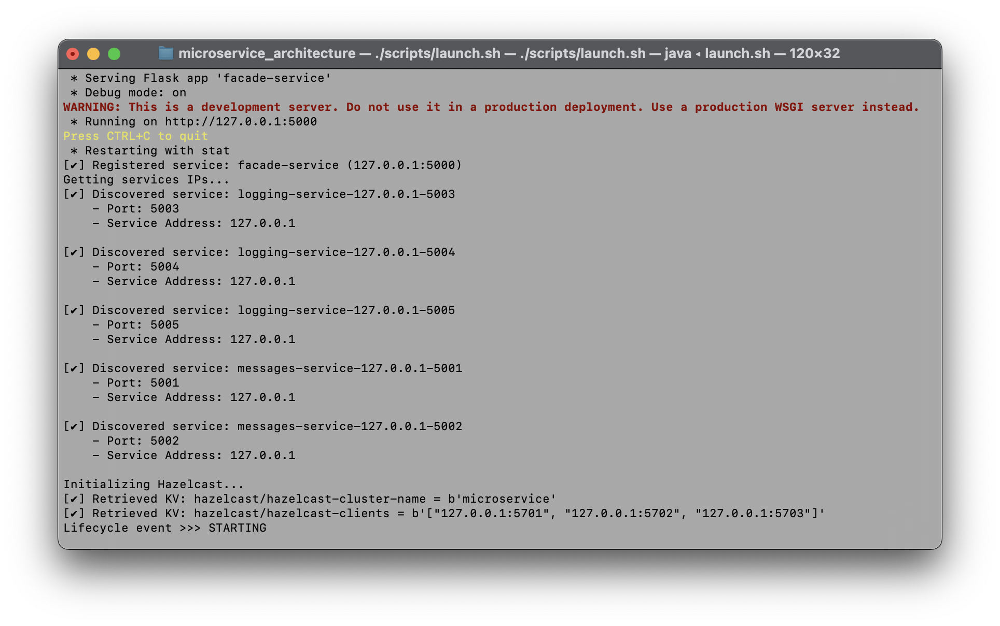

    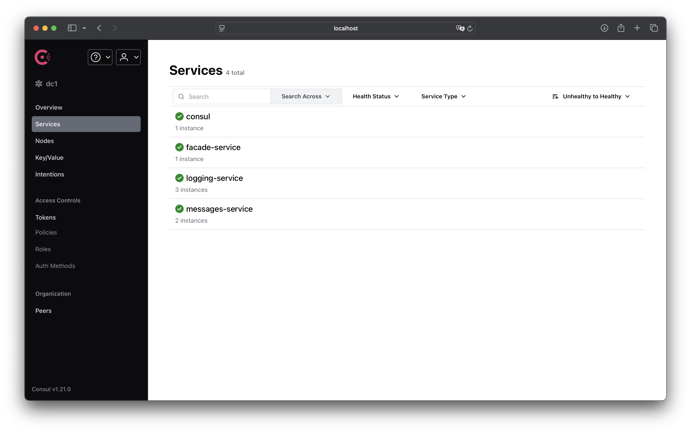

    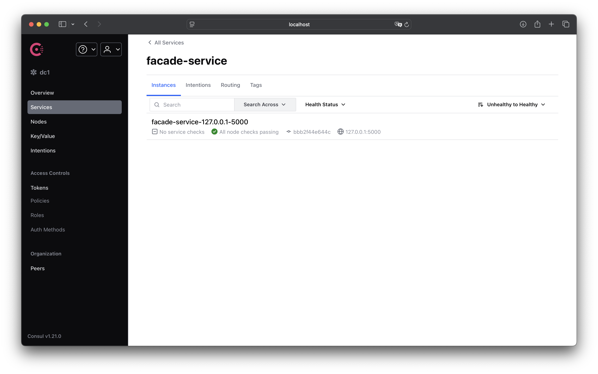

    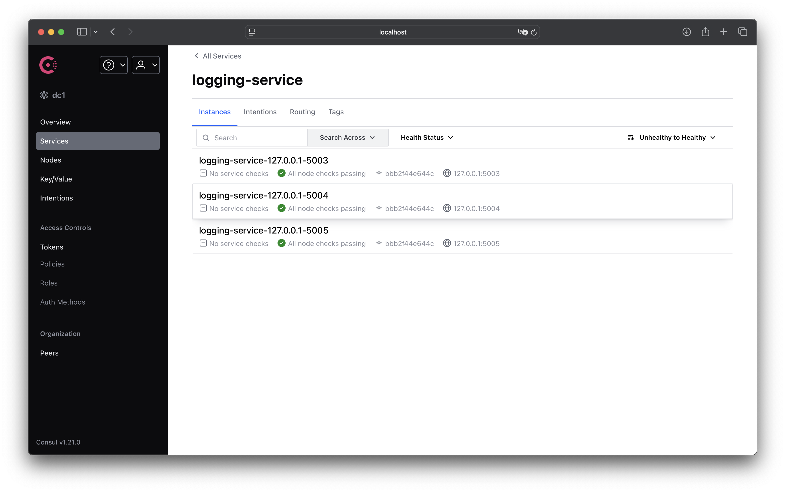

    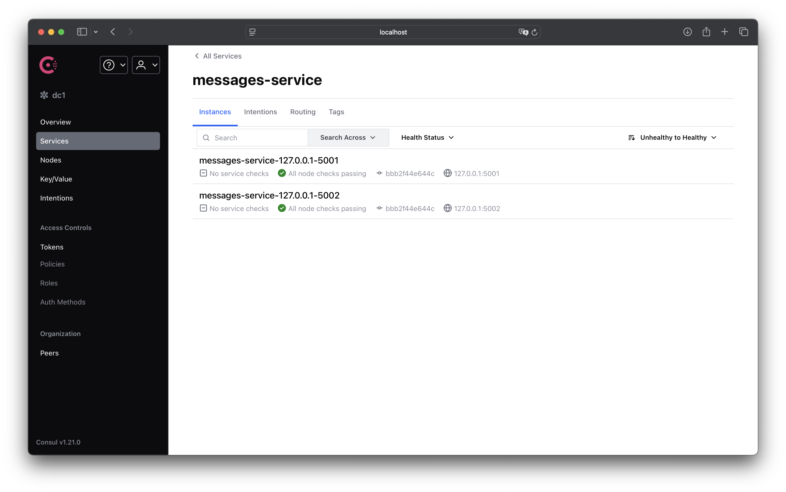

    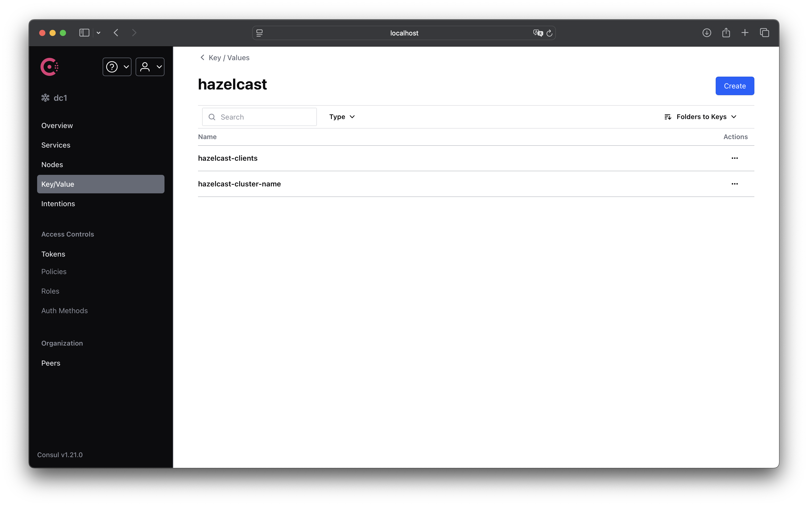

    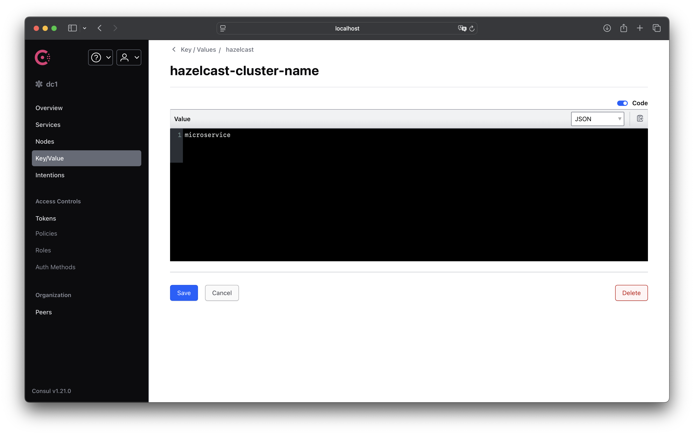

    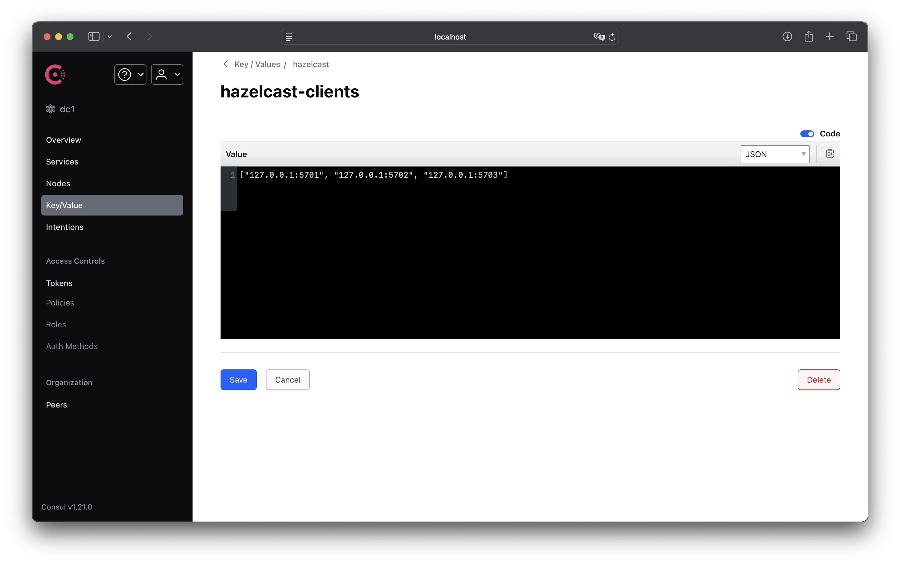

    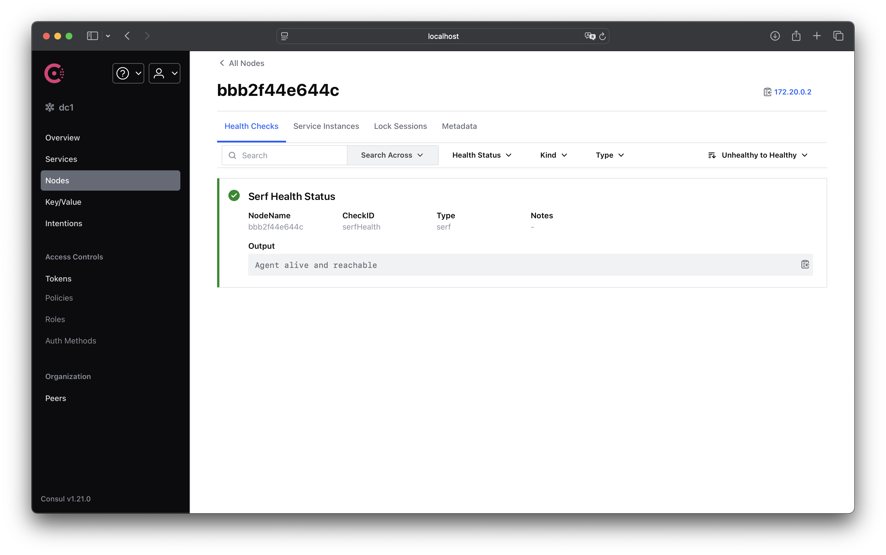

3. POST request

    ```shell
    ./scripts/send_post_req.sh
    ```

    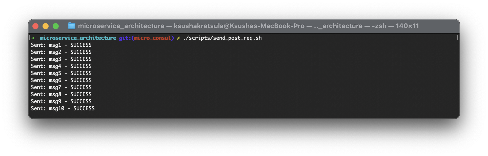

4. GET request

    ```shell
    ./scripts/send_get_req.sh
    ```

    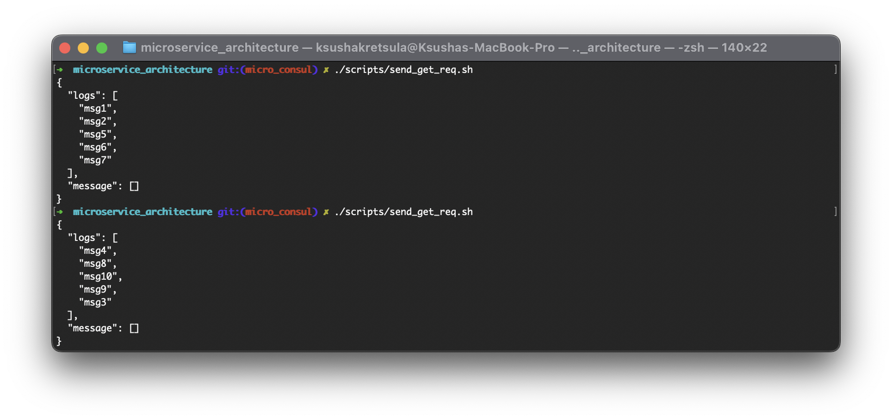

5. Disabling an instance of a microservice

    We will disable an instance of logging service with the Hazelcast instance:

    ```shell
    ./scripts/test_shut_down.sh 1
    ```

    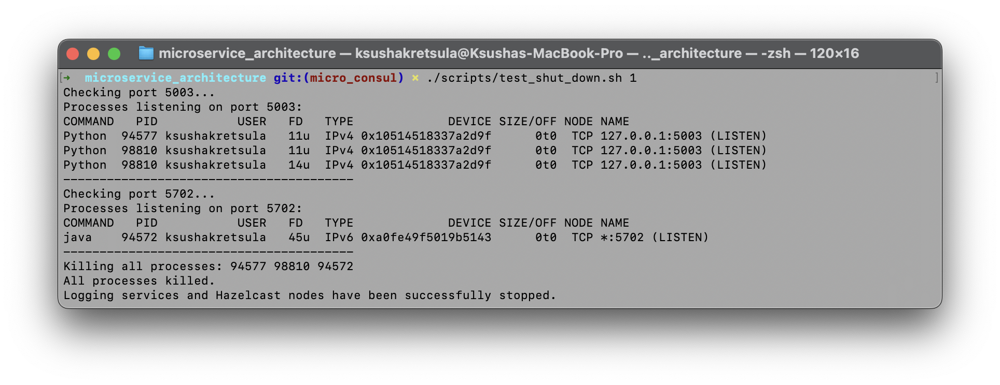

    Now we can test GET request:

    ```shell
    ./scripts/send_get_req.sh
    ```

    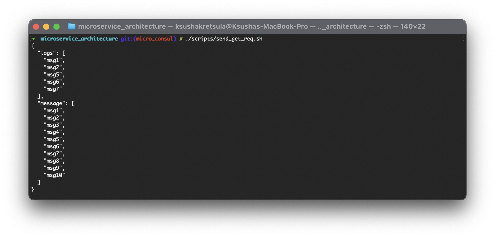

    All messages are now stored on one istance as expected.

    Now we can test POST request:

    ```shell
    ./scripts/send_post_req.sh
    ```

    

6. Stop the system

    ```shell
    ./scripts/kill.sh
    ```

    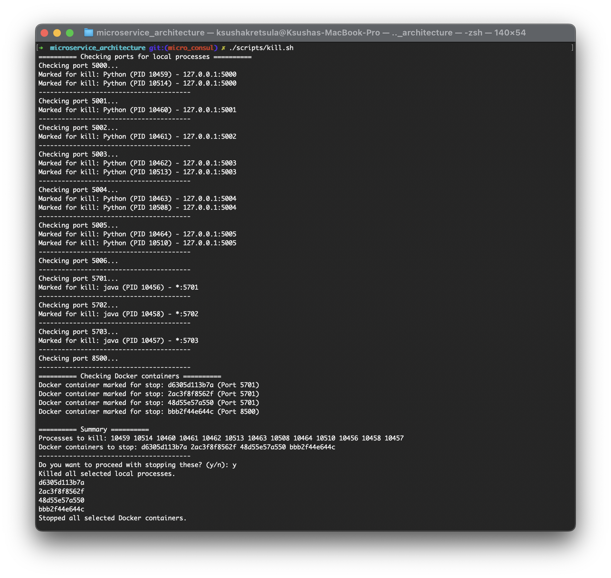

### Resources

- [Youtube video. Practical tasks and Project description. Task 5](https://youtu.be/FHSX10qWwBU?si=ZihfJqyWadA9DiCz&t=3458)
- [Consul in Docker](https://learn.hashicorp.com/tutorials/consul/docker-container-agents) (образи з новими версіями публікуються на https://hub.docker.com/r/hashicorp/consul)
- [Consul Services](https://www.consul.io/docs/discovery/services)
- [Register Service](https://www.consul.io/api-docs/agent/service#register-service)
- [Consul Key-Value Config](https://www.consul.io/docs/dynamic-app-config/kv)
- [Consul Key-Value](https://www.consul.io/api-docs/kv)
- [Consul Client Libraries & SDKs](https://developer.hashicorp.com/consul/api-docs/libraries-and-sdks)
