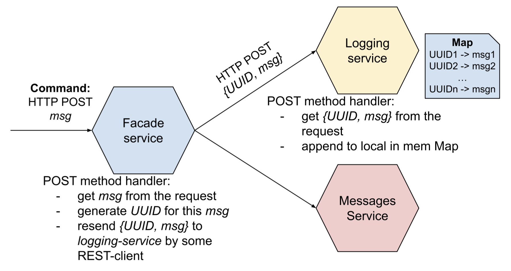
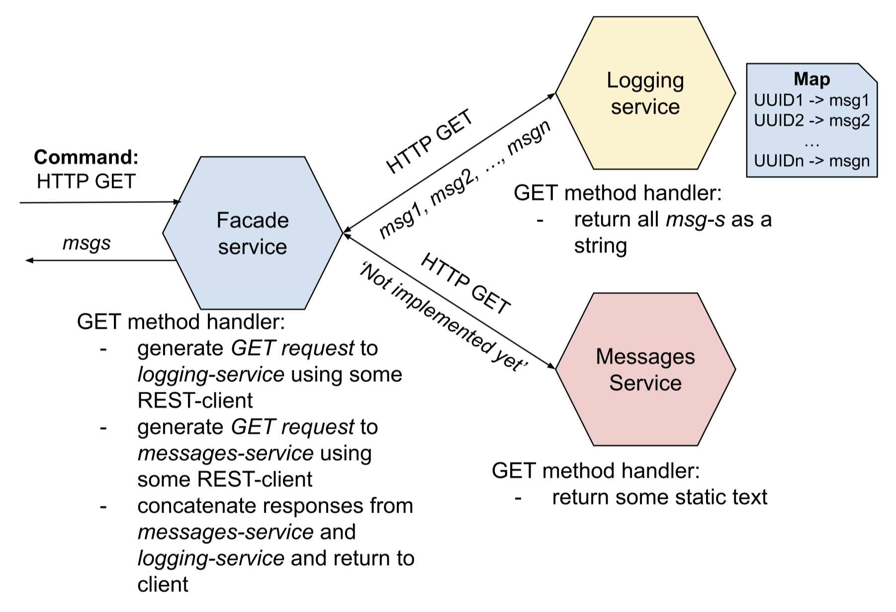

# Microservice architecture

Github: [Microservice architecture](https://github.com/kretsulaksusha/microservice_architecture.git)

## Task 1. Basic microservices architecture

Github: [Microservice architecture. Task 1](https://github.com/kretsulaksusha/microservice_architecture/tree/micro_basics)

The task requires the implementation of 3 microservices, the interaction between which is based on the HTTP protocol, preferably based on the REST API paradigm (gRPC protocol can also be used).

The architecture consists of 3 microservices:
- `facade-service` - accepts POST/GET requests from the client
- `logging-service` - stores in memory all the messages it receives and can return them
- `messages-service` - while acting as a stub, when accessed, it returns a static message

### Basic system functionality

The client interacts with the `facade-service` via HTTP POST and GET requests. The client can be curl, Postman, a browser in Dev mode, etc.

- Description of HTTP POST request flow
    - The client sends a POST request to the `facade-service` with a specific text message - `msg`
    - After receiving the message, the `facade-service` generates a unique `UUID` for it 
    - The pair `{UUID, msg}` is sent to the `logging-service` as a POST message using the REST/HTTP-client program in the form of a POST message
    - The `logging-service`, having received the message, saves it and the identifier to the local hash table (the identifier is used as a key) and displays the received message in its console

    

- Description of HTTP GET request flow

    - The client sends a GET request to the `facade-service`
    - After receiving the request, the `facade-service` generates GET requests to the `logging-service` and `messages-service` using the REST/HTTP-client program
    - `logging-service`, upon receiving the request, returns all messages (without keys) stored in the hash table as a string
    - `messages-service`, upon receiving a request, returns static text, for example, 'not implemented yet'
    - `facade-service`, after receiving responses from `logging-service` and `messages-service`, concatenates the text of both responses and returns to the client

    

### Additional system functionality

- Availability of a `retry` mechanism:
    - In the event of a connection failure, delay, or lack of response from the logging service, a `retry` mechanism should be used to try to repeat the same message transmission operation
    - Simultaneously with the `retry` mechanism, the logging service should use deduplication for messages (exactly once delivery) to check that the same message is not repeated several times
    - The protocol should show that the `retry` mechanism has been tested

## Prerequisites

- Python

### Installation

```
git clone https://github.com/kretsulaksusha/microservice_architecture.git
cd microservice_architecture
```

### Project structure

```
├── README.md
├── facade-service
│   └── facade-service.py
├── logging-service
│   └── logging-service.py
├── media
│   ├── http_get.png
│   └── http_post.png
└── messages-service
    └── messages-service.py
```

### Usage

1. Open 3 terminal windows in root directory.
2. In the first terminal, navigate to `facade-service` and run:

   ```bash
   cd facade-service
   python3 facade-service.py
   ```
3. In the second terminal, navigate to `logging-service` and run:

   ```bash
   cd logging-service
   python3 logging-service.py
   ```
4. In the third terminal, navigate to `messages-service` and run:

   ```bash
   cd messages-service
   python3 messages-service.py
   ```
5. Open a fourth terminal window to test the services using `curl`:

    - POST

        ```bash
        curl -X POST http://localhost:5000/facade -H "Content-Type: application/json" -d '{"msg": "msg1"}'
        ```

        Output:

        ```
        {
            "status": "success",
            "uuid": "493027ba-43f0-4d90-b5c2-0b53d1e42bd8"
        }
        ```

    - GET

        ```bash
        curl -X GET http://localhost:5000/facade
        ```

        Output:

        ```
        {
            "logs": [
                "msg1"
            ],
            "message": "not implemented yet"
        }
        ```
6. Test the retry mechanism:

    - Temporarily stop the `logging-service`.
    - Send a POST request to the `facade-service` as shown in step 5.
    - Observe the `facade-service` console for retry attempts:

    ```
    Retrying... Error: ...
    Retrying... Error: ...
    Retrying... Error: ...
    ```

### Results

The application was tested as described in the Usage section. Below are the results:

1. POST requests

    ```bash
    curl -X POST http://localhost:5000/facade -H "Content-Type: application/json" -d '{"msg": "msg1"}'
    ```

    

    ```bash
    curl -X POST http://localhost:5000/facade -H "Content-Type: application/json" -d '{"msg": "msg2"}'
    curl -X POST http://localhost:5000/facade -H "Content-Type: application/json" -d '{"msg": "msg3"}'
    ```

    

2. GET requests

    ```bash
    curl -X GET http://localhost:5000/facade
    ```

    

3. Retry mechanism

    Ar first, we need to stop one of the services, for example, `logging-service`. Then run:

    ```bash
    curl -X POST http://localhost:5000/facade -H "Content-Type: application/json" -d '{"msg": "msg4"}'
    ```

    

    ```bash
    curl -X GET http://localhost:5000/facade
    ```

    

### Resources

- [Microservices basics task demo](https://youtu.be/w5EBi2nT_B0?si=VsBAShgPBd7piEKG)
- [Curl requests](https://www.warp.dev/terminus/curl-post-request)
