# Microservice architecture

Github: [Microservice architecture](https://github.com/kretsulaksusha/microservice_architecture.git)

## Task 3. Microservices using Hazelcast Distributed Map

Github: [Microservice architecture. Task 3](https://github.com/kretsulaksusha/microservice_architecture/tree/micro_hazelcast)

The task is based on the first task and is its development.

The following should be added to the `logging-service`:
- as a message store use Hazelcast Distributed Map
- the ability to run multiple copies of the `logging-service` at the same time
- `facade-service` randomly selects which copy of the `logging-service` to access to write and read messages

### Basic system functionality

The client interacts with the `facade-service` via HTTP POST and GET requests. The client can be curl, Postman, a browser in Dev mode, etc.

- A new Hazelcast instance is started when the `logging-service` is launched (or the Hazelcast client connects to its Hazelcast cluster node)
- The `logging-service` uses the Hazelcast Distributed Map to store messages instead of the local hash table
- the `facade-service` with which the client interacts randomly selects a `logging-service` instance when sending POST/GET (GRPC) requests
- if the selected `logging-service` instance is not available, the next one is selected, etc.

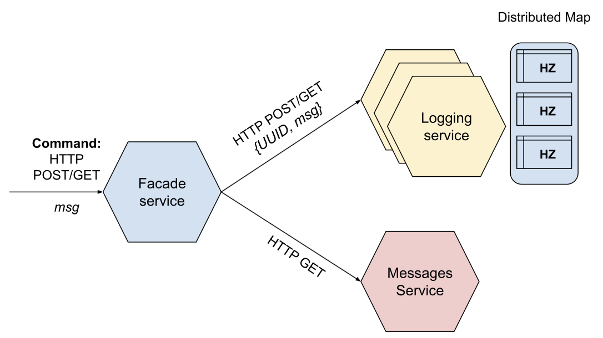

### Task

- Start 3 instances of the `logging-service` (locally they can run on different ports), respectively, 3 instances of Hazelcast should also be started.
- Using HTTP POST, write 10 messages msg1-msg10 through the `facade-service`.
- Show which messages each of the `logging-service` instances received (this should be visible in the service logs).
- Read the messages via HTTP GET from `facade-service`.
- Shut down 1 or 2 instances of the `logging-service` (Hazelcast nodes should be shut down as well) and check if we can read the messages.

### Additional system functionality

Due to the fact that there may now be several running instances of the `logging-service`, the `facade-service` must know their IP addresses to access them. The list of IP addresses can be contained in the code of the `facade-service` itself or passed to it at startup, but this approach is not flexible in case of dynamic assignment or change of these addresses.

Therefore, it is proposed to include information about the IP addresses of other microservices in a separate registry, which will be managed by the `config-server` (later it will be replaced by Service registry and discovery).

Now, before accessing the `logging-service` and `messages-service`, the `facade-service` must make a request to the `config-server`, where it will be returned a list of all IP addresses of instances of this service by the service name.

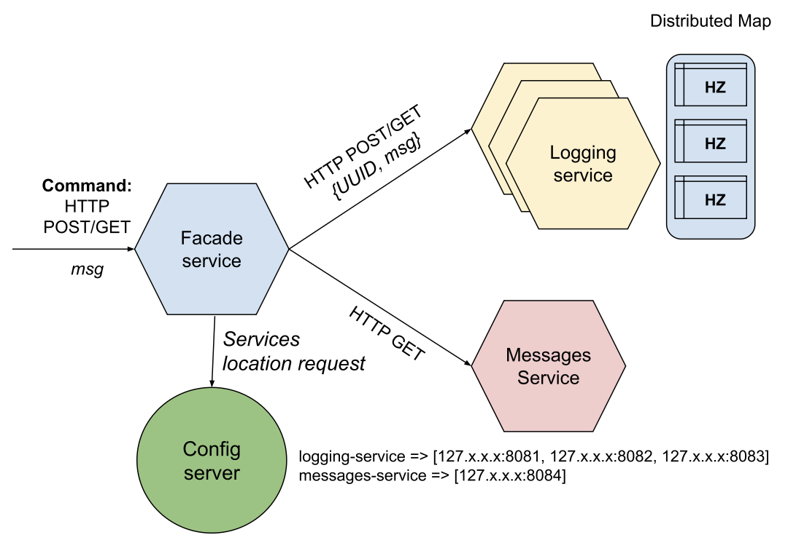

The list of IP addresses of microservices on the `config-server` can be taken from the configuration file or passed from the command line when it is launched.

## Prerequisites

- Python (Hazelcast)

### Installation

```
git clone https://github.com/kretsulaksusha/microservice_architecture.git
cd microservice_architecture
git checkout micro_hazelcast
```

### Project structure

```
```

### Usage

#### Configuration File: `config.toml`

The `config.toml` file holds all the essential service IPs and Hazelcast cluster details for the microservices architecture. It’s organized into sections for clarity and easy maintenance.

1. Services Configuration (`[service_ips]`)

This section defines IPs and ports for the core microservices:

```toml
[service_ips]
messages-service = ["127.0.0.1:5001"]
logging-service = ["127.0.0.1:5002", "127.0.0.1:5003", "127.0.0.1:5004"]
```

2. Hazelcast Configuration (`[hazelcast]`)

This section sets up the Hazelcast cluster:

```toml
[hazelcast]
hazelcast-cluster-name = "microservice"
hazelcast-clients = ["127.0.0.1:5701", "127.0.0.1:5702", "127.0.0.1:5703"]
```

Feel free to modify IPs and cluster settings.

#### System

1. To launch the system we need to start:
    - a `facade-service`;
    - a `messages-service`;
    - 3 instances of the `logging-service`;
    - 3 instances of Hazelcast nodes.

    This can be done by running the script `scripts/launch.sh`:

    ```shell
    chmod +x scripts/launch.sh
    ./scripts/launch.sh
    ```

    Additionally, we can run Hazelcast Managment Center:

    ```shell
    hz-mc start
    ```

2. Using HTTP POST we can write 10 messages msg1-msg10 through the `facade-service`.

    In the terminal we will observe limited information that the messages are sent. For verbose version all output is written to the file stored in `scripts/logs` directory. Also, `facade-service` will log which messages each of the `logging-service` instances received.

    ```shell
    chmod +x scripts/send_post_req.sh
    ./scripts/send_post_req.sh
    ```

3. Read the messages via HTTP GET from `facade-service`.

    ```shell
    chmod +x scripts/send_get_req.sh
    ./scripts/send_get_req.sh
    ```

4. Testing the system.

    Shut down 1 or 2 instances of the `logging-service` as well as Hazelcast nodes and check if we can read the messages.

    ```shell
    chmod +x scripts/test_shut_down.sh
    ./scripts/test_shut_down.sh 1
    ```

    Then run HTTP GET and POST requests:

    ```shell
    ./scripts/send_get_req.sh
    ```

    ```shell
    ./scripts/send_post_req.sh
    ```

    ```shell
    ./scripts/send_get_req.sh
    ```

    Relaunch the system and run the same command but know shut down 2 services:

    ```shell
    chmod +x scripts/test_shut_down.sh
    ./scripts/test_shut_down.sh 2
    ```

    Then run POST and GET requests.

5. Stop the system.

    ```shell
    chmod +x scripts/kill.sh
    ./scripts/kill.sh
    ```

### Results

The application was tested as described in the Usage section. Below are the results:

1. Launching the system:

    ```shell
    chmod +x scripts/launch.sh
    ./scripts/launch.sh
    ```

    Additionally, we can run Hazelcast Managment Center:

    ```shell
    hz-mc start
    ```

    

2. Using HTTP POST we can write 10 messages msg1-msg10 through the `facade-service`. In the terminal we will observe limited information that the message is sent.

    ```shell
    chmod +x scripts/send_post_req.sh
    ./scripts/send_post_req.sh
    ```

    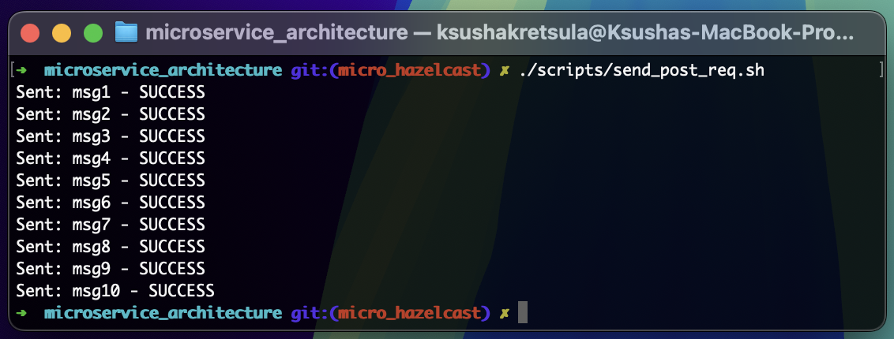

    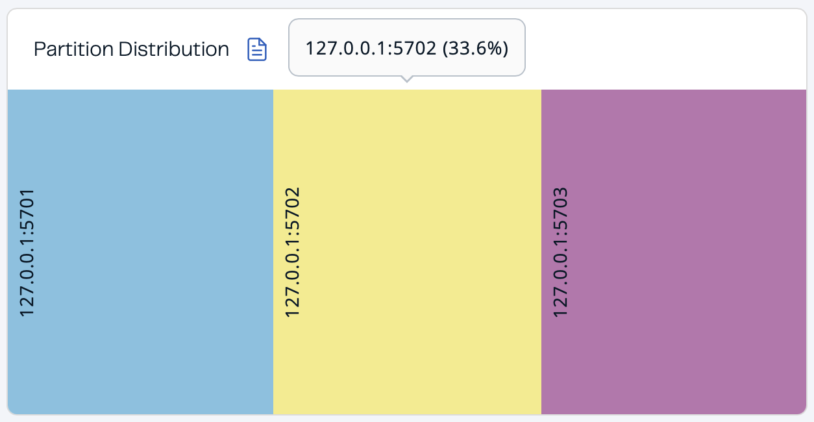

    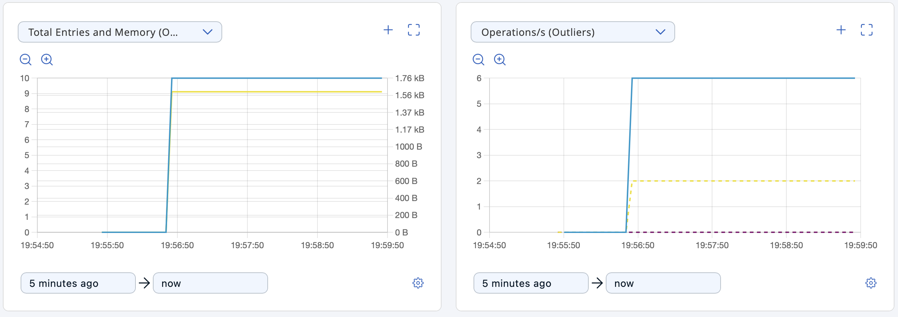

    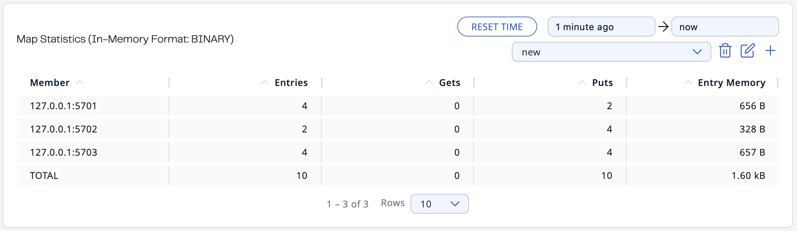

    For verbose version all output is written to the file stored in `scripts/logs` directory.

    Content of `scripts/logs/`:

    ```
    Logging time: 24-03-2025 00:17:11
    {
    "status": "success",
    "uuid": "c04efb3c-3ddd-4a65-a7eb-4a78634debf4"
    }
    {
    "status": "success",
    "uuid": "5ac75e3d-65a5-4de8-b2c6-314e010dd29c"
    }
    {
    "status": "success",
    "uuid": "a7bb5027-39cc-4600-9120-db14a57f908f"
    }
    {
    "status": "success",
    "uuid": "44b9d397-c5c7-4066-a098-1362f4057b79"
    }
    {
    "status": "success",
    "uuid": "2cce74e5-5698-4597-9149-78cc328580ef"
    }
    {
    "status": "success",
    "uuid": "829e3694-1dc0-4a4a-b4d1-c8a2ed1f5d69"
    }
    {
    "status": "success",
    "uuid": "6e27eabe-de9c-43e9-811b-fa1e18eb6f9a"
    }
    {
    "status": "success",
    "uuid": "e6035a94-2f88-4541-9325-d68e231affba"
    }
    {
    "status": "success",
    "uuid": "b995c51b-3f7c-4705-ad2b-6534aa3735a6"
    }
    {
    "status": "success",
    "uuid": "b4b66ea8-bc5f-453a-aae7-1e45760e8a65"
    }
    ```

3. Read the messages via HTTP GET from `facade-service`.

    ```shell
    chmod +x scripts/send_get_req.sh
    ./scripts/send_get_req.sh
    ```

    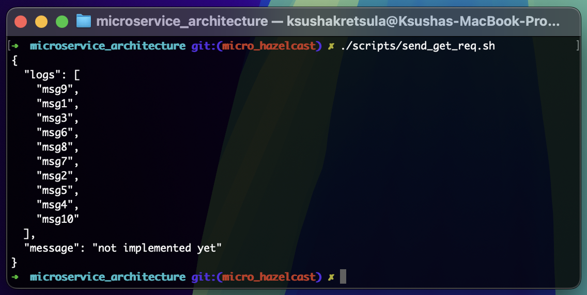

4. Testing the system.

    Shut down 1 or 2 instances of the `logging-service` as well as Hazelcast nodes and check if we can read the messages.

    **Shutting down 1 node:**

    ```shell
    chmod +x scripts/test_shut_down.sh
    ./scripts/test_shut_down.sh 1
    ```

    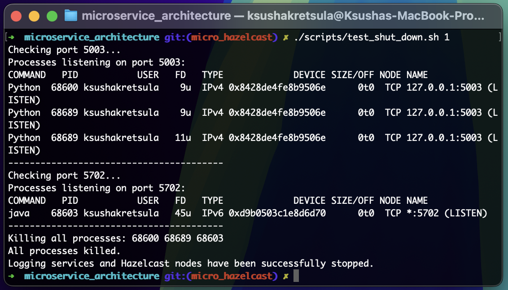

    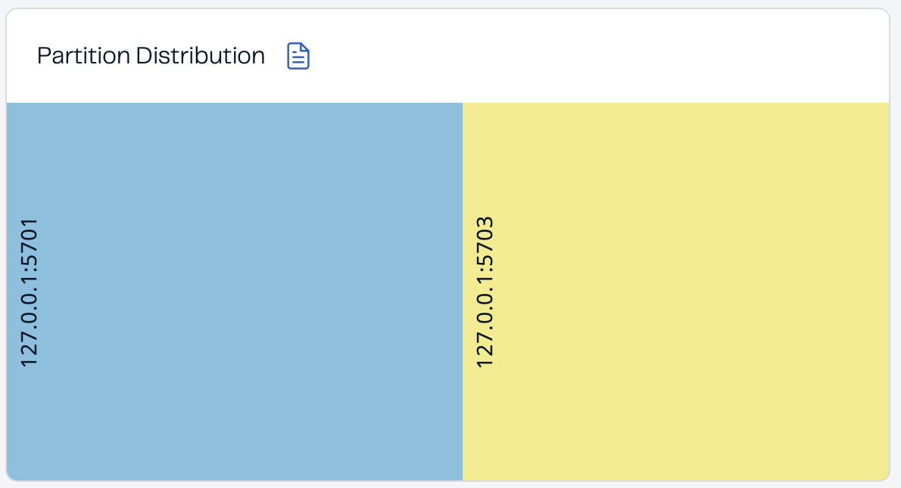

    

    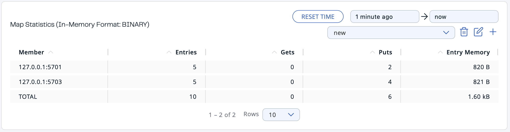

    Then run HTTP GET and POST requests:

    ```shell
    ./scripts/send_get_req.sh
    ```

    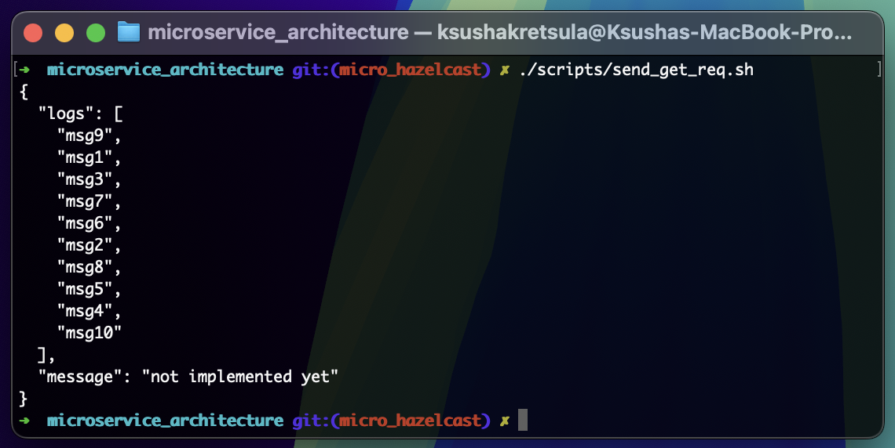

    ```shell
    ./scripts/send_post_req.sh
    ```

    

    ```shell
    ./scripts/send_get_req.sh
    ```

    

    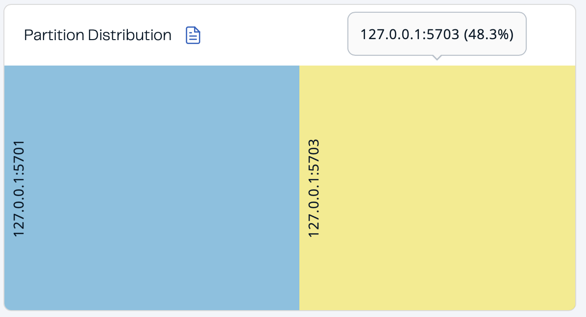

    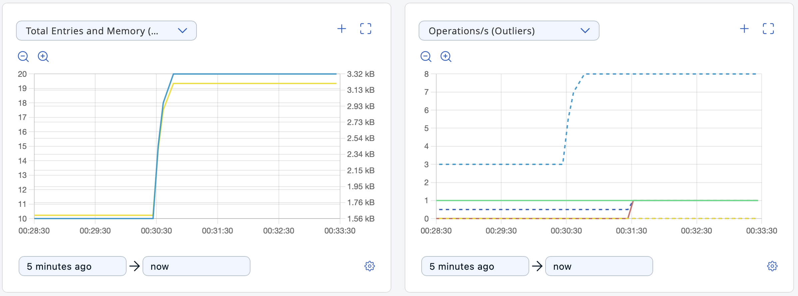

    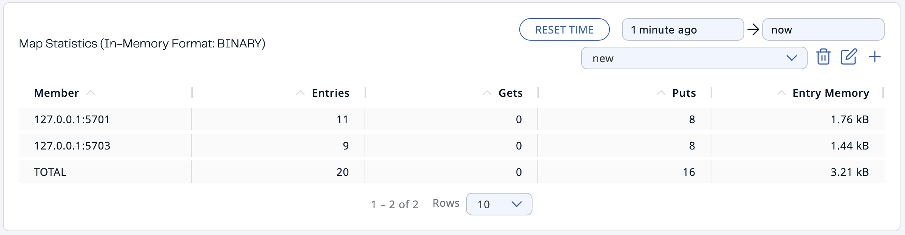

    To be sure that there are no same sreenshots you can open logs in `scripts/logs`.

    **Shutting down 2 nodes:**

    ```shell
    ./scripts/test_shut_down.sh 2
    ```

    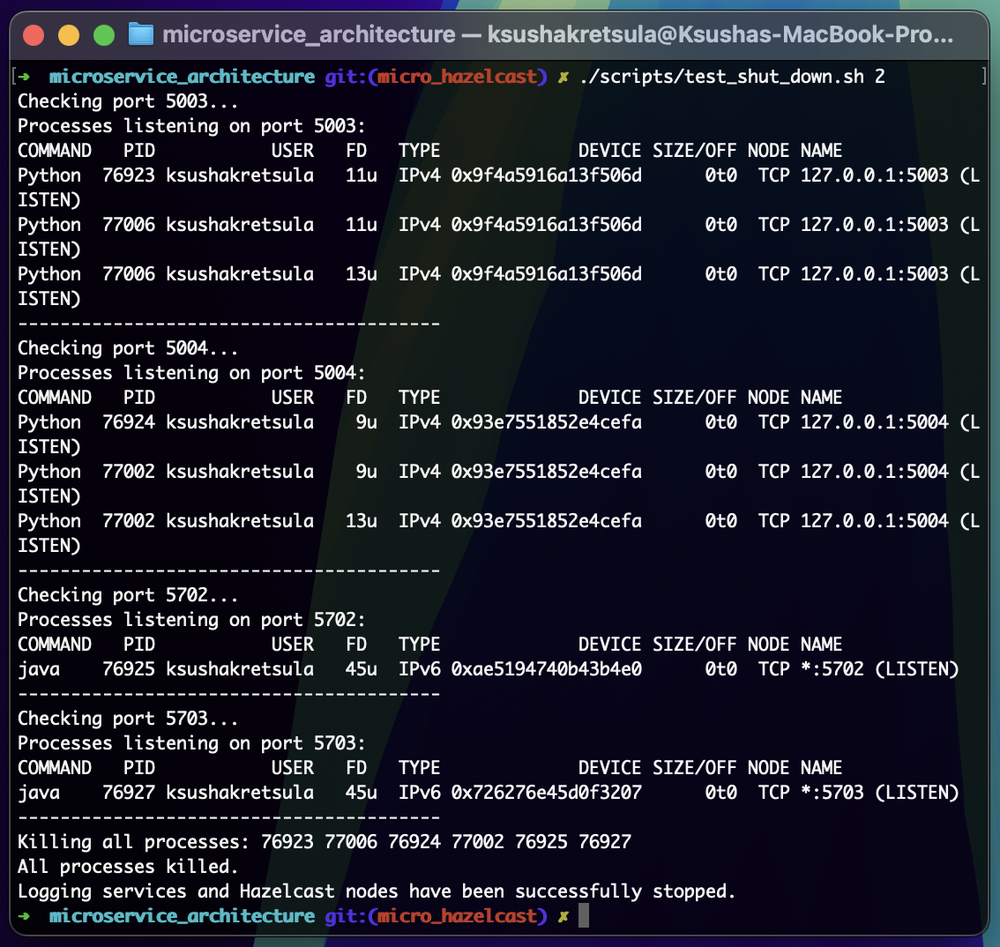

    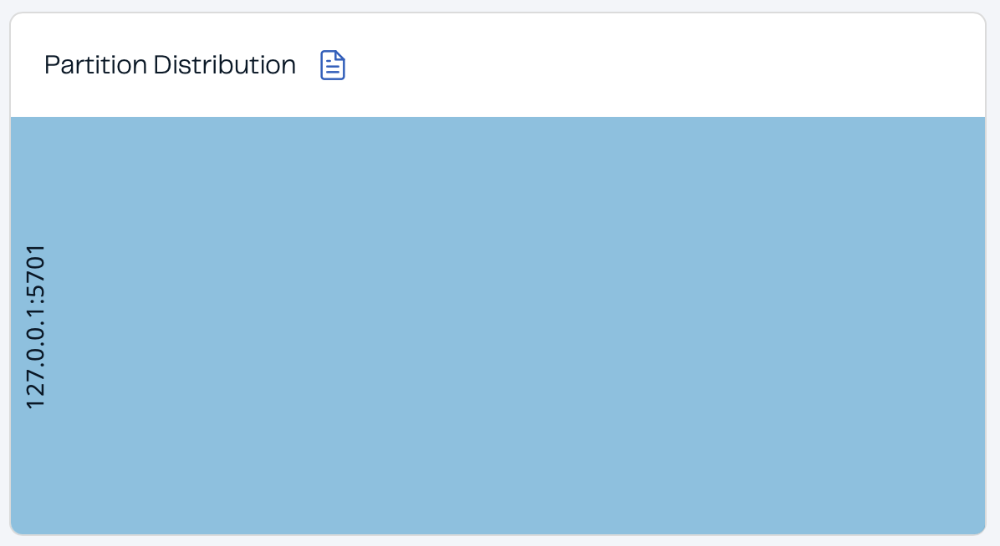

    

    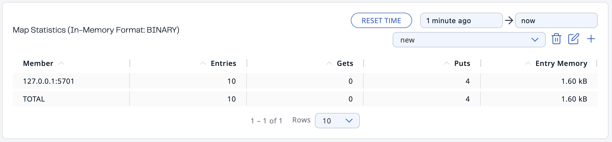

    Then run HTTP GET and POST requests:

    ```shell
    ./scripts/send_get_req.sh
    ```

    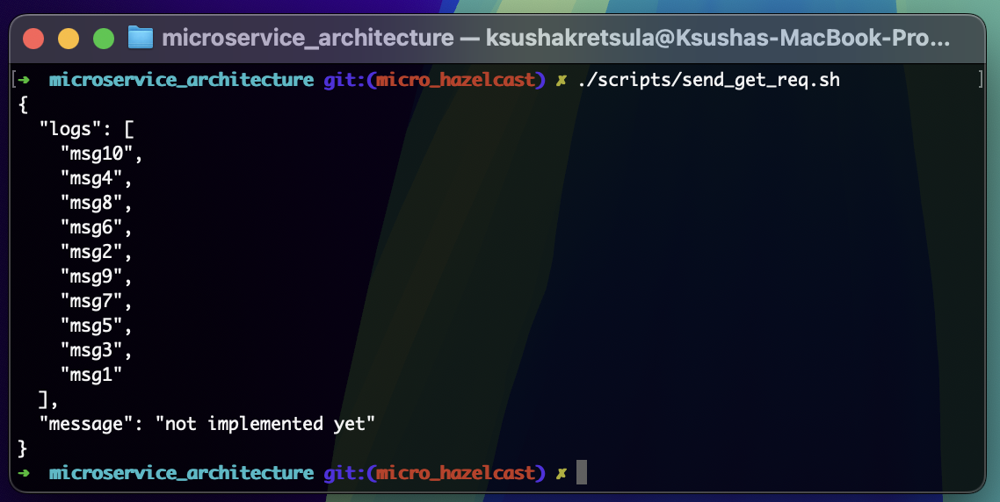

    ```shell
    ./scripts/send_post_req.sh
    ```

    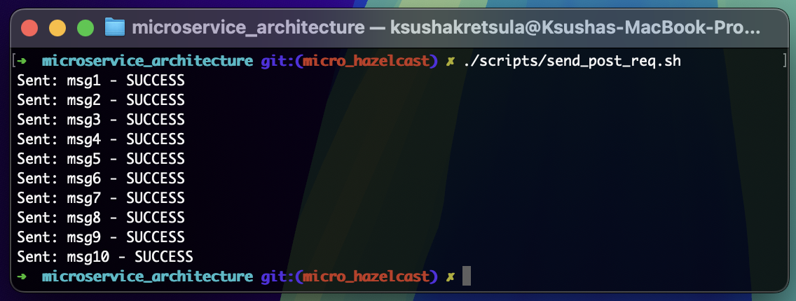

    ```shell
    ./scripts/send_get_req.sh
    ```

    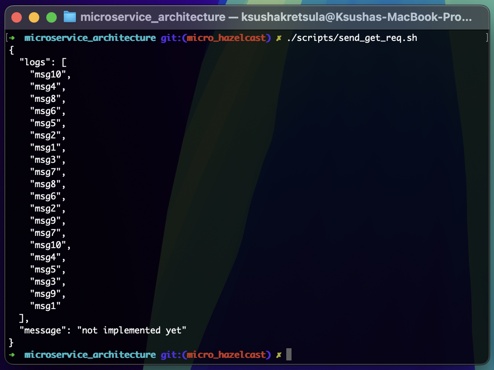

    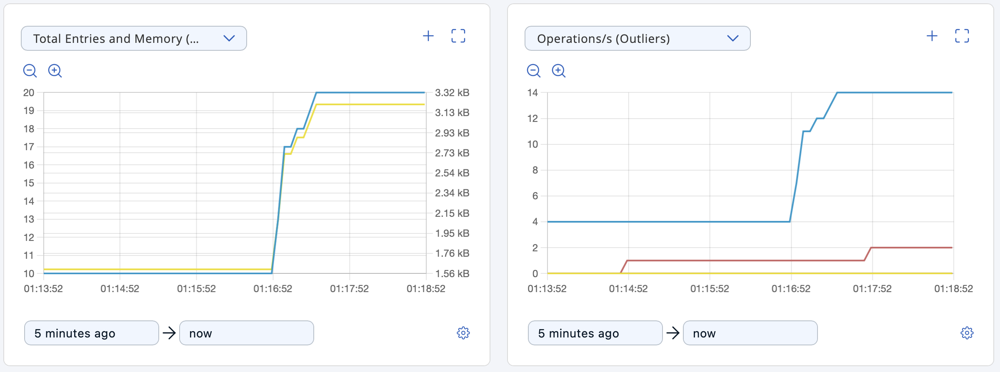

    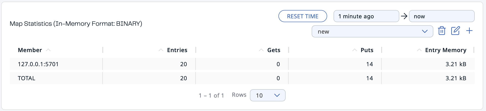

    To be sure that there are no same sreenshots you can open logs in `scripts/logs`.

5. Stop the system.

    ```shell
    chmod +x scripts/kill.sh
    ./scripts/kill.sh
    ```

### Resources

- [Microservices with Hazelcast task demo](https://youtu.be/D4mkt6t1Nzk)
- [Curl requests](https://www.warp.dev/terminus/curl-post-request)
