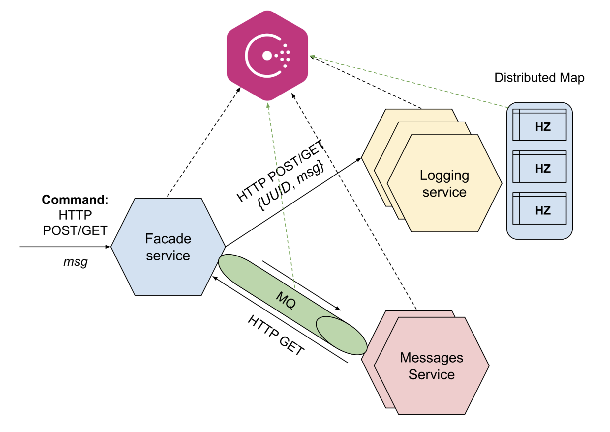

# Microservice architecture

Github: [Microservice architecture](https://github.com/kretsulaksusha/microservice_architecture.git)

## Task 4. Microservices using Message Queue

Github: [Microservice architecture. Task 4](https://github.com/kretsulaksusha/microservice_architecture/tree/micro_mq)

The task is based on the functionality developed in the previous task and is its further development.

To `messages-service` you need to add:

- message queue as a message delivery channel between `facade-service` and `messages-service`
- the ability to run multiple copies of `messages-service` simultaneously
- `facade-service` randomly selects which copy of `messages-service` to access to read messages

It is suggested to use as a Messaging queue:

- [Hazelcast Queue](https://docs.hazelcast.com/hazelcast/5.5/data-structures/queue) (5 points) or
- [Kafka](https://hub.docker.com/r/apache/kafka) (10 points)

### System functionality

The client interacts with the `facade-service` via HTTP POST and GET requests. The client can be curl, Postman, a browser in Dev mode, etc.

- It is necessary to deploy a Messaging queue cluster - Hazelcast Distributed Queue (2 servers are enough) or Kafka (3 servers are required) and configure queue replication (see below)
- When a POST request is received by `facade-service`, it should add the message from the request to the message queue
- Copies of the `messages-service` should read the messages (producer/consumer scheme) and store them in memory
- during a GET request, the `facade-service` with which the client interacts randomly selects a `messages-service` instance and returns all messages stored on this instance via the REST (HTTP) protocol



### Task

- Start 3 instances of `logging-service` (locally they can be run on different ports), respectively, 3 instances of Hazelcast should also start
- Run 2 instances of `messages-service` (locally they can be run on different ports)
- Write 10 messages msg1-msg10 via HTTP POST through `facade-service`
- Show which messages each of the `logging-service` instances received (this should be visible in the service logs)
- Show what messages each of the `messages-service` instances received (this should be visible in the service logs)
- Call HTTP GET on `facade-service` several times and get the combined 2 sets of messages - these should be messages from `logging-service` and `messages-service`

### Checking the fault tolerance of a message queue

A classic message queue stores the messages added to it on its side, so if its server suddenly goes down, the messages contained in the queue will become inaccessible and may be lost altogether.

To prevent this, it is recommended to set up a cluster for the message queue, i.e. run several servers and set up replication (or backup for Hazelcast) between them. Now, if one server from the message queue cluster goes down, messages will be available from its replica

In this work, you need to configure such a cluster for Hazelcast (or Kafka) and test its fault tolerance.

To test the fault tolerance, you will need to verify that there will be no loss of messages if one of the message queue servers goes down.

To do this:

- do not run (disable) 2 instances of `messages-service` so that messages are not temporarily read and stored in the message queue
- send 10 (or 100) messages through the `facade-service`
- switch off one of the servers (message queue)
  - for Hazelcast, it should be a server with a lower IP address
  - for Kafka, it should be the so-called Leader
- start 2 instances of `messages-service` and check that they received all messages from the queue

## Prerequisites

- Python (Hazelcast)

### Installation

```text
git clone https://github.com/kretsulaksusha/microservice_architecture.git
cd microservice_architecture
git checkout micro_mq
```

### Project structure

```text
```

### Usage

#### Configuration File: `config.toml`

The `config.toml` file holds all the essential service IPs and Hazelcast cluster details for the microservices architecture. It’s organized into sections for clarity and easy maintenance.

1. Services Configuration (`[service_ips]`)

    This section defines IPs and ports for the core microservices:

    ```toml
    [service_ips]
    messages-service = ["127.0.0.1:5001", "127.0.0.1:5002"]
    logging-service = ["127.0.0.1:5003", "127.0.0.1:5004", "127.0.0.1:5005"]
    ```

2. Hazelcast Configuration (`[hazelcast]`)

    This section sets up the Hazelcast cluster:

    ```toml
    [hazelcast]
    hazelcast-cluster-name = "microservice"
    hazelcast-clients = ["127.0.0.1:5701", "127.0.0.1:5702", "127.0.0.1:5703"]
    ```

Feel free to modify IPs and cluster settings.

#### System

At first we need to set the permissions with the command:

```shell
chmod -R +x scripts
```

1. To launch the system we need to start:
    - a `facade-service`;
    - 2 instances of the `messages-service`;
    - 3 instances of the `logging-service`;
    - 3 instances of Hazelcast nodes.

    This can be done by running the script `scripts/launch.sh`:

    ```shell
    ./scripts/launch.sh
    ```

    Additionally, we can run Hazelcast Managment Center:

    ```shell
    hz-mc start
    ```

2. Using HTTP POST we can write 10 messages msg1-msg10 through the `facade-service`.

    In the terminal we will observe limited information that the messages are sent. For verbose version all output is written to the file stored in `scripts/logs` directory. Also, `facade-service` will log which messages each of the `logging-service` instances received.

    ```shell
    ./scripts/send_post_req.sh
    ```

3. Read the messages via HTTP GET from `facade-service`.

    We need to call HTTP GET on `facade-service` several times to get the combined 2 sets of messages from `messages-service`.

    ```shell
    ./scripts/send_get_req.sh
    ```

4. Testing fault tolerance.

    Verify that there will be no loss of messages if one of the message queue servers goes down.

    Do not run (disable) 2 instances of `messages-service` so that messages are not temporarily read and stored in the message queue:

    ```shell
    ./scripts/launch_no_messages_services.sh
    ```

    Send 10 (or 100) messages through the `facade-service`:

    ```shell
    ./scripts/send_post_req.sh
    ```

    Switch off one of the servers (message queue):

    ```shell
    ./scripts/test_shut_down.sh 1
    ```

    > Note: for Hazelcast it should be a server with a lower IP address.

    Start 2 instances of `messages-service` and check that they received all messages from the queue:

    ```shell
    ./scripts/test_start_messages_services.sh
    ```

    ```shell
    ./scripts/send_get_req.sh
    ```

5. Stop the system.

    ```shell
    ./scripts/kill.sh
    ```

### Results

The application was tested as described in the Usage -> System section. Below are the results:

1. Launching the system:

    ```shell
    ./scripts/launch.sh
    ```

    Additionally, we can run Hazelcast Managment Center:

    ```shell
    hz-mc start
    ```

    

2. Using HTTP POST we can write 10 messages msg1-msg10 through the `facade-service`.

    In the terminal we will observe limited information that the messages are sent. For verbose version all output is written to the file stored in `scripts/logs` directory. Also, `facade-service` will log which messages each of the `logging-service` instances received.

    ```shell
    ./scripts/send_post_req.sh
    ```

    

    

    

    

    For verbose version all output is written to the file stored in `scripts/logs` directory.

    Content of `scripts/logs/`:

    ```text
    ```

3. Read the messages via HTTP GET from `facade-service`.

    We need to call HTTP GET on `facade-service` several times to get the combined 2 sets of messages from `messages-service`.

    ```shell
    ./scripts/send_get_req.sh
    ```

    

4. Testing fault tolerance.

    Verify that there will be no loss of messages if one of the message queue servers goes down.

    Do not run (disable) 2 instances of `messages-service` so that messages are not temporarily read and stored in the message queue:

    ```shell
    ./scripts/launch_no_messages_services.sh
    ```

    

    Send 10 (or 100) messages through the `facade-service`:

    ```shell
    ./scripts/send_post_req.sh
    ```

    

    Switch off one of the servers (message queue):

    ```shell
    ./scripts/test_shut_down.sh 1
    ```

    > Note: for Hazelcast it should be a server with a lower IP address.

    

    

    

    

    Start 2 instances of `messages-service` and check that they received all messages from the queue:

    ```shell
    ./scripts/test_start_messages_services.sh
    ```

    

    ```shell
    ./scripts/send_get_req.sh
    ```

    

5. Stop the system.

    ```shell
    ./scripts/kill.sh
    ```

### Resources

- [Youtube video. Practical tasks and Project description. Task 4](https://youtu.be/FHSX10qWwBU?si=BBa1HlqGdktM-cZs&t=2945)
- [Curl requests](https://www.warp.dev/terminus/curl-post-request)
- [Hazelcast. Queue](https://docs.hazelcast.com/hazelcast/5.5/data-structures/queue)
