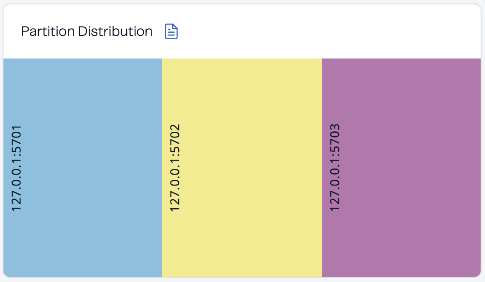

# Microservice architecture

Github: [Microservice architecture](https://github.com/kretsulaksusha/microservice_architecture.git)

OS: MacOS.

## Task 2. Deploying and working with distributed in-memory data structures based on Hazelcast: Distributed Map

Github: [Microservice architecture. Task 2](https://github.com/kretsulaksusha/microservice_architecture/tree/hazelcast)

**Hazelcast** is a distributed platform for storing and processing real-time data in RAM. “Distributed” means that each of the nodes (servers) of the system runs its own instance of Hazelcast, which are then combined into a common cluster. Within this cluster, you can create various distributed data structures through the API: Map, Queue, Topic, Lock, Data-stream processing pipeline, etc.

Thus, the Hazelcast platform can be used as a fast in-memory cache, a system for distributed computing, a system for processing a stream of messages in real time, etc.

---

**Running Hazelcast from a Java application**:

Nodes can be created and run directly from a Java application that will run on the same server as the Hazelcast instance: https://docs.hazelcast.com/hazelcast/5.3/getting-started/get-started-java.

The application will have access to these distributed data structures via the API and will be able to write to/from them. 

```java
HazelcastInstance hzInstance = Hazelcast.newHazelcastInstance();
Map<String, String> distributedMap = hzInstance.getMap( “capitals” );
    capitalcities.put( “1”, “Tokyo” );
    capitalcities.put( “2”, “Paris” );
```

At the same time, other applications connected to other nodes of the Hazelcast cluster will also see changes in the distributed data structures and can also write to/from them.

[Hazelcast. Choosing an Application Topology](https://docs.hazelcast.com/hazelcast/5.3/deploy/choosing-a-deployment-option)

---

**Running Hazelcast nodes separately**:

Another way is to run the cluster nodes as [separate applications via the command line](https://docs.hazelcast.com/hazelcast/5.3/getting-started/get-started-binary) or as [a Docker container](https://docs.hazelcast.com/hazelcast/5.3/getting-started/get-started-docker) and connect to it using clients that exist for different programming languages.

```java
HazelcastInstance hzInstance = Hazelcast.newHazelcastClient();
Map<String, String> distributedMap = hzInstance.getMap( “capitals” );
    capitalcities.put( “1”, “Tokyo” );
    capitalcities.put( “2”, “Paris” );
```

---

### Task

1. Install and configure [Hazelcast](https://hazelcast.com/open-source-projects/downloads/).

2. Configure and run 3 nodes (instances) clustered either as part of a Java application or as separate applications: [Step 6. Scale your Cluster](https://docs.hazelcast.com/hazelcast/5.3/getting-started/get-started-binary#step-6-scale-your-cluster).

3. Demonstrate the work of [Distributed Map](https://docs.hazelcast.com/hazelcast/5.3/data-structures/creating-a-map):
    - using the API in any language that has a client for Hazelcast, create a Distributed Map
    - write 1000 values to it with keys from 0 to 1000
    - using [the Management Center](https://docs.hazelcast.com/management-center/5.3/getting-started/install), look at the distribution of keys across nodes 
    - see how the data distribution by nodes changes:
        - if you disconnect one node (the results should be in the protocol)
        - disconnect two nodes sequentially (the results should be in the protocol)
        - disconnect two nodes at the same time (by emulating the “fall” of servers or using the `kill -9` command) (the results should be in the protocol)
        - Will there be data loss?
        - How to avoid data loss?

4. Demonstrate how Distributed Map works without locks
    - using 3 clients, on each of them simultaneously run the value increment for the same key in a loop for 10K iterations:
        ```java
        map.putIfAbcent(“key”, 0);
        for ( int k = 0; k < 10_000; k++ ) {
            var value = map.get( “key” );
            value++;
            map.put( “key”, value );
        }
        ```
    - see what the final value for the key “key” will be (will it be 30K?)

5. Do the same with [a pessimistic locking](http://docs.hazelcast.org/docs/latest/manual/html-single/index.html#locking-maps) and measure the time.

6. Do the same with [an optimistic locking](http://docs.hazelcast.org/docs/latest/manual/html-single/index.html#locking-maps) and measure the time.

7. Compare the results of each of the runs
    - For the implementation without locks, you should observe data loss.
    - For the implementation with pessimistic and optimistic locks, you should get the same results.
    - Is the pessimistic or optimistic approach faster?

8. Working with Bounded queue
    - based on [Distributed Queue](https://docs.hazelcast.com/hazelcast/5.3/data-structures/queue#creating-an-example-queue), configure [Bounded queue](https://docs.hazelcast.com/hazelcast/5.3/data-structures/queue#configuring-queue) for 10 items
    - run one client that will write values 1..100 to the queue, and two others that will read from the queue
    - when reading, each message should be read at once
    - how will the values be read from the queue by two clients? 
    - check what the write behavior will be if there is no reading and the queue is full

## Prerequisites

- Python (Hazelcast)

### Installation

```
git clone https://github.com/kretsulaksusha/microservice_architecture.git
cd microservice_architecture
git checkout hazelcast
```

### Project structure

```
.
├── README.md
├── hazelcast-client-queue.xml
├── hazelcast-client-support-backup.xml
├── hazelcast-client.xml
├── media
│   └── ...
└── src
    ├── bounded_queue
    │   ├── bounded_queue.py
    │   ├── bounded_queue_no_read.py
    │   └── process_result.py
    ├── distributed_map
    │   ├── distributed_map.py
    │   └── test.py
    ├── no_locks
    │   ├── increment_key.py
    │   ├── process_result.py
    │   ├── result.txt
    │   └── start_3_processes.py
    ├── optimistic_lock
    │   ├── increment_key.py
    │   ├── process_result.py
    │   ├── result.txt
    │   └── start_3_processes.py
    ├── pessimistic_lock
    │   ├── increment_key.py
    │   ├── process_result.py
    │   ├── result.txt
    │   └── start_3_processes.py
    └── utils
        └── colors.py
```

## Results

The Hazelcast was downloaded using `brew` package manager and started a cluster from 4 nodes to initially check that it is working properly:


With these 4 nodes I connected managment center:


---

### Demonstration of the work of [Distributed Map](https://docs.hazelcast.com/hazelcast/5.3/data-structures/creating-a-map)

1. **Start Hazelcast Clients**
    
    Open 3 terminal windows and run the following command in each:
    
    ```shell
    hz start -c "hazelcast-client.xml"
    ```

    This starts 3 clients, each connecting to the Hazelcast cluster with the name `dev`.

2. **Monitor the Cluster**
    
    To manage and monitor your Hazelcast cluster, start the Hazelcast Management Center:

    ```shell
    hz-mc start
    ```

3. **Populate the Distributed Map**
    
    In a new terminal window, run the Python script to populate the map with 1000 key-value pairs:

    ```shell
    python3 src/distributed_map/distributed_map.py
    ```

    This script writes data with keys ranging from `0` to `999`.


- using [the Management Center](https://docs.hazelcast.com/management-center/5.3/getting-started/install), look at the distribution of keys across nodes

    
    

    

- see how the data distribution by nodes changes:
    - if you disconnect one node

        

        There is no data loss.

    - disconnect two nodes sequentially

        

        There is no data loss.

    - disconnect two nodes at the same time (by emulating the “fall” of servers or using the `kill -9` command)

        Get the PIDs of the nodes:

        ```shell
        lsof -i tcp:5702
        lsof -i tcp:5703
        ```

        

        Forcefully kill both nodes:

        ```shell
        kill -9 
        ```

        

    - Will there be data loss?

        As a result, 347 entries were lost, confirmed by running:

        ```
        python3 src/test.py
        ```

        

    - How to avoid data loss?

        I have identified 3 approaches:

        1. **Backups**
        
            Hazelcast supports backups for each entry. Thus, we can update your Hazelcast client configuration file with:

            ```xml
            <map name="distributed-map">
                <backup-count>1</backup-count>
                <async-backup-count>1</async-backup-count>
            </map>
            ```

            *(File: `hazelcast-client-support-backup.xml`)*

            This ensures a copy of your data is stored on another node.

            Test setup:
            - Start 3 nodes.
            - Populate the map.
            - Kill 2 nodes simultaneously.
            - Verify data integrity.

            Setup with 3 nodes and populated map:

            

            After killing 2 nodes:

            

            Result: No data loss confirmed:

            

        2. **High Availability (HA) Setup**

            - Deploy more nodes to tolerate multiple failures.
            - Enable **Partition Grouping** to ensure backups are placed on different physical machines.

        3. **Persistence**
        
            Enable the use of external storage to persist data.

### Demonstrate how Distributed Map works without locks

1. **Start Hazelcast Clients**
    Open 3 terminal windows and run the following command in each:
    
    ```shell
    hz start -c "hazelcast-client.xml"
    ```

    This starts 3 clients, each connecting to the Hazelcast cluster with the name `dev`.

2. **Monitor the Cluster**
    To manage and monitor your Hazelcast cluster, start the Hazelcast Management Center:

    ```shell
    hz-mc start
    ```

3. **Populate the Distributed Map**
    In a new terminal window, run the Python script to populate the map with 1000 key-value pairs:

    ```shell
    python3 src/no_locks/start_3_processes.py
    ```

    This script starts 3 processes running `increment_key.py` program that updates the key `0` incrementing in by 1, and then writes the final value of the key `0` to `txt` file.

- using 3 clients, on each of them simultaneously run the value increment for the same key in a loop for 10K iterations

    

- what the final value for the key “key” will be?

    Running `src/no_locks/start_3_processes.py` script for 50 times we store results in `src/no_locks/result.txt` then taking average by running the script `src/no_locks/process_result.py`:

    ```shell
    python3 src/no_locks/process_result.py
    ```

    Output:

    Average final value: **12863**.

- will it be 30K?

    Without locks, Hazelcast does not guarantee atomic increments across nodes, so the final value is less than 30000 due to race conditions (overwrites occuring).

### Do the same with [a pessimistic locking](http://docs.hazelcast.org/docs/latest/manual/html-single/index.html#locking-maps) and measure the time

One way to solve the race issue is by using pessimistic locking - lock the map entry until you are finished with it.


As expected, every time the final value is 30K.

Running `src/pessimistic_lock/start_3_processes.py` script for 20 times we store results in `src/pessimistic_lock/result.txt` then taking average by running the script `src/pessimistic_lock/process_result.py`:

```shell
python3 src/pessimistic_lock/process_result.py
```

Output:

Average taken time: **12.82** seconds.

### Do the same with [an optimistic locking](http://docs.hazelcast.org/docs/latest/manual/html-single/index.html#locking-maps) and measure the time

In Hazelcast, you can apply the optimistic locking strategy with the map’s `replace` method.


As expected, every time the final value is 30K.

Running `src/optimistic_lock/start_3_processes.py` script for 20 times we store results in `src/optimistic_lock/result.txt` then taking average by running the script `src/optimistic_lock/process_result.py`:

```shell
python3 src/optimistic_lock/process_result.py
```

Output:

Average taken time: **8.41** seconds.

### Compare the results of each of the runs

- For the implementation without locks, you should observe data loss.

    Described above.

- For the implementation with pessimistic and optimistic locks, you should get the same results.

    Described above.

- Is the pessimistic or optimistic approach faster?

    **The optimistic approach is faster.**

    Optimistic locking assumes that conflicts are **rare** and allows multiple threads to modify data simultaneously. It relies on detecting conflicts **after** a thread completes its work. Thus, it is faster due to non-blocking behavior, more scalable, supports higher throughput and no deadlock risk. However, it may require retries in write-heavy systems, leading to wasted work and inconsistent performance under high contention.

    Pessimistic locking assumes that conflicts are **likely** to occur. Therefore, it **locks** the data entry to ensure only one thread can modify it at a time. Thus, it prevents race conditions entirely but it is slower due to blocked threads waiting for the lock.

    *Additional information from documentation:*

    > Optimistic locking is better for mostly read-only systems. It has a performance boost over pessimistic locking.
    > 
    > Pessimistic locking is good if there are lots of updates on the same key. It is more robust than optimistic locking from the perspective of data consistency.

### Working with Bounded queue

- based on [Distributed Queue](https://docs.hazelcast.com/hazelcast/5.3/data-structures/queue#creating-an-example-queue), configure [Bounded queue](https://docs.hazelcast.com/hazelcast/5.3/data-structures/queue#configuring-queue) for 10 items

    To the basic configuration we need to add:

    ```xml
    <queue name="queue">
        <max-size>10</max-size>
        <backup-count>1</backup-count>
        <async-backup-count>1</async-backup-count>
    </queue>
    ```

    Queue configured for 10 items is in `hazelcast-client-queue.xml`.

- run one client that will write values 1..100 to the queue, and two others that will read from the queue

    Structure:

    - **Producer Thread**: Writes values from 1 to 100 to the bounded queue. If the queue is full, the producer will block until space is available.
  
    - **Consumer Threads**: Two consumer threads are implemented, each responsible for consuming values from the queue. The consumers rely on the following:
        - **Poison Pill**: Consumers use a "poison pill" signal to stop processing once all items have been consumed.
        - **Queue Size**: Consumers check the queue size to ensure they do not attempt to consume from an empty queue.

- how will the values be read from the queue by two clients?

    When running the program `src/bounded_queue/bounded_queue.py` for the first 2 times, inconsistent behavior is observed:

    1. The first run produces fewer than 100 values.

        

    2. The second run produces more than 100 values.

        

    However, subsequent runs work correctly, and consumers consistently read values.

    

    Mostly, consumers read values one by one.

- check what the write behavior will be if there is no reading and the queue is full

    *The behaviour is as written in documentation:*

    > When the producer is started, 10 items are put into the queue and then the queue will not allow more put operations. When the consumer is started, it will remove items from the queue. This means that the producer can put more items into the queue until there are 10 items in the queue again, at which point the put operation again becomes blocked.

    

### Resources

- [Hazelcast Platform](https://docs.hazelcast.com/hazelcast/5.5/)
- [Hazelcast Python Client](https://hazelcast.com/clients/python/)
- [Hazelcast Documentation. Map](https://hazelcast.readthedocs.io/en/stable/api/proxy/map.html)
- [Github hazelcast-python-client](https://github.com/hazelcast/hazelcast-python-client)
- [Practical tasks and Project description](https://youtu.be/FHSX10qWwBU?si=MymYsQh5u-G4hGkC&t=1620)
- [Hazelcast Documentation. Backing up Maps](https://docs.hazelcast.com/hazelcast/5.5/data-structures/backing-up-maps)
- [Hazelcast Documentation. High Availability mode](https://docs.hazelcast.com/operator/5.14/high-availability-mode)
- [Hazelcast Documentation. Persistance](https://docs.hazelcast.com/hazelcast/5.5/storage/configuring-persistence#hide-nav)
